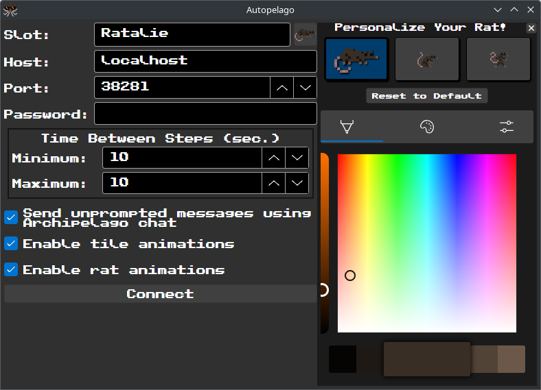

# Autopelago

A game that's so easy, it plays itself!

Intended to integrate with [Archipelago](https://archipelago.gg) to help people practice by themselves in a realistic(ish) setting.

## Get Started

Generate your seed using the .apworld file from [whichever release](https://github.com/airbreather/Autopelago/releases). A sample YAML is provided as well. If you need further help, check Archipelago's own documentation (perhaps one of the [tutorials](https://archipelago.gg/tutorial)).

Once it's running, head over to https://autopelago.app and enter the usual Archipelago parameters. For host/port, you can either fill the separate text boxes or paste the complete `host:port` format into the "Host" box.

In unusual cases (especially if you need to change what's in the "Host" box), you may have trouble connecting using the version hosted on https://autopelago.app. If that happens, you will need to host Autopelago yourself. The release should have a zip file containing everything you need. It's a static site, so you just need to host it using any web server software (just loading index.html in your browser won't work these days).

## The Game

Once connected, a rat will autonomously move across the game world, sending location checks along the way. Its own items that it receives will be more-or-less what you expect:

- It has its own "progression"-tier items that are required to unblock progression through certain gated checkpoints.
- It also has "helpful"- / "trap"-tier items that apply certain buffs / debuffs.
- Finally, there are many "filler"-tier items that do nothing when received.

For the most part, the rat just moves around the map every several seconds, trying to complete a check at each location it reaches. These attempts get easier the more "rats" that they've received, but locations further along the path will be harder, so it balances out.

### Menu Screen

- Slot / Host / Port / Password: Standard inputs that you need for any Archipelago game. See [the official docs](https://archipelago.gg/tutorial/Archipelago/setup/en#connection-info) for details.
- Time Between Steps (sec.): Number of seconds that the rat spends between actions. Smaller numbers will send location checks faster.
- Enable tile animations: Whether or not to animate the landmark tiles on the map background.
- Enable rat animations: Whether or not to animate the rat's wiggle on the map screen.

The others should be self-explanatory.

## Commands

The rat accepts commands telling it to focus on making specific location checks. To do this, send a chat message like `@RatName go "Before Basketball #5"`, where `RatName` is the rat's slot name or alias and `"Before Basketball #5"` is the name of the location to check.

If you no longer want it to focus a location, you can `@RatName stop "Before Basketball #5"` to have it remove that from the queue.

`@RatName list` will show a list of locations that it's been asked to focus (up to the first 5).

You can always run `@RatName help` to get a list of all commands.

### How "Focus" Works

The rat can't reach every location on the map at all times — sometimes, it needs to make certain other location checks in order to get there. In fact, until it receives a few "rats", all it can reach are the "Before Basketball" items!

If you tell it to "focus" a location that it physically can't reach, then it won't change the rat's priorities until that location actually opens up. Don't worry, though, the rat will head that way as soon as it can.

Sometimes, though, the rat will have its own ideas about what's important, depending on what buffs (or traps) it receives. You might need to wait your turn...

## Map Window

### Buff / Debuff Reference

The game screen has some information about the rat's situation. Here's what they mean:

|Label|Effect|
|:-|:-|
|`Food` (> 0)|The next time it acts, the rat gets a little bit more done|
|`Food` (< 0)|The next time it acts, the rat gets a little bit less done|
|`Energy` (> 0)|The rat's next movement is free|
|`Energy` (< 0)|The rat's next movement costs twice as much as usual|
|`Luck` (> 0)|The next attempt at a location check will automatically succeed|
|`Luck` (< 0)|The next attempt at a location check will be quite a bit harder|
|`Distract`|The next time it goes to act, the rat will get absolutely nothing done|
|`Startle`|The next time it goes to act, the rat will move a little bit closer to the start of the map|
|`Smart`|The rat is moving towards a location with a "progression"-tier item|
|`Conspiratorial`|The rat is moving towards a location with a "trap"-tier item|
|`Style`|The next attempt at a location check will be quite a bit easier|
|`Confidence`|The next negative effect that the rat would receive is ignored|

### Items Panel

Down the left-hand side of the screen are icons that quickly show which (progression) items the rat has / has not received based on whether or not the icon is lit up.

You can click any of these icons to send a `!hint` command for it:

### The Map Itself

Each landmark location has its own icon that you can mouse over to see what the rat needs in order to clear it. Some require a specific item (or two), while others just need your pack to be big enough to push through.

Locations with a gray exclamation point above them are missing requirements. Locations with a yellow exclamation mark over them can be completed once the rat makes it over to there. Locations without anything above them have already been checked and will be lit up.

You can pause the game at any time using the pause button in the bottom-left. Click it again to resume.
